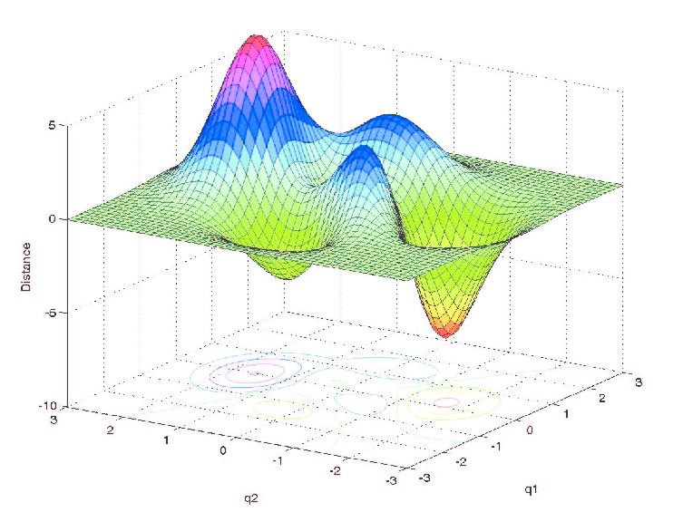

```python
import pandas as pd
import warnings
warnings.filterwarnings('ignore')
```


```python
df = pd.read_csv('Housing_Prices/train.csv')
print(len(df))
df.head()
```

    1460


<div>
<style>
    .dataframe thead tr:only-child th {
        text-align: right;
    }

    .dataframe thead th {
        text-align: left;
    }

    .dataframe tbody tr th {
        vertical-align: top;
    }
</style>
<table border="1" class="dataframe">
  <thead>
    <tr style="text-align: right;">
      <th></th>
      <th>Id</th>
      <th>MSSubClass</th>
      <th>MSZoning</th>
      <th>LotFrontage</th>
      <th>LotArea</th>
      <th>Street</th>
      <th>Alley</th>
      <th>LotShape</th>
      <th>LandContour</th>
      <th>Utilities</th>
      <th>...</th>
      <th>PoolArea</th>
      <th>PoolQC</th>
      <th>Fence</th>
      <th>MiscFeature</th>
      <th>MiscVal</th>
      <th>MoSold</th>
      <th>YrSold</th>
      <th>SaleType</th>
      <th>SaleCondition</th>
      <th>SalePrice</th>
    </tr>
  </thead>
  <tbody>
    <tr>
      <th>0</th>
      <td>1</td>
      <td>60</td>
      <td>RL</td>
      <td>65.0</td>
      <td>8450</td>
      <td>Pave</td>
      <td>NaN</td>
      <td>Reg</td>
      <td>Lvl</td>
      <td>AllPub</td>
      <td>...</td>
      <td>0</td>
      <td>NaN</td>
      <td>NaN</td>
      <td>NaN</td>
      <td>0</td>
      <td>2</td>
      <td>2008</td>
      <td>WD</td>
      <td>Normal</td>
      <td>208500</td>
    </tr>
    <tr>
      <th>1</th>
      <td>2</td>
      <td>20</td>
      <td>RL</td>
      <td>80.0</td>
      <td>9600</td>
      <td>Pave</td>
      <td>NaN</td>
      <td>Reg</td>
      <td>Lvl</td>
      <td>AllPub</td>
      <td>...</td>
      <td>0</td>
      <td>NaN</td>
      <td>NaN</td>
      <td>NaN</td>
      <td>0</td>
      <td>5</td>
      <td>2007</td>
      <td>WD</td>
      <td>Normal</td>
      <td>181500</td>
    </tr>
    <tr>
      <th>2</th>
      <td>3</td>
      <td>60</td>
      <td>RL</td>
      <td>68.0</td>
      <td>11250</td>
      <td>Pave</td>
      <td>NaN</td>
      <td>IR1</td>
      <td>Lvl</td>
      <td>AllPub</td>
      <td>...</td>
      <td>0</td>
      <td>NaN</td>
      <td>NaN</td>
      <td>NaN</td>
      <td>0</td>
      <td>9</td>
      <td>2008</td>
      <td>WD</td>
      <td>Normal</td>
      <td>223500</td>
    </tr>
    <tr>
      <th>3</th>
      <td>4</td>
      <td>70</td>
      <td>RL</td>
      <td>60.0</td>
      <td>9550</td>
      <td>Pave</td>
      <td>NaN</td>
      <td>IR1</td>
      <td>Lvl</td>
      <td>AllPub</td>
      <td>...</td>
      <td>0</td>
      <td>NaN</td>
      <td>NaN</td>
      <td>NaN</td>
      <td>0</td>
      <td>2</td>
      <td>2006</td>
      <td>WD</td>
      <td>Abnorml</td>
      <td>140000</td>
    </tr>
    <tr>
      <th>4</th>
      <td>5</td>
      <td>60</td>
      <td>RL</td>
      <td>84.0</td>
      <td>14260</td>
      <td>Pave</td>
      <td>NaN</td>
      <td>IR1</td>
      <td>Lvl</td>
      <td>AllPub</td>
      <td>...</td>
      <td>0</td>
      <td>NaN</td>
      <td>NaN</td>
      <td>NaN</td>
      <td>0</td>
      <td>12</td>
      <td>2008</td>
      <td>WD</td>
      <td>Normal</td>
      <td>250000</td>
    </tr>
  </tbody>
</table>
<p>5 rows × 81 columns</p>
</div>


```python
df.info()
```

    <class 'pandas.core.frame.DataFrame'>
    RangeIndex: 1460 entries, 0 to 1459
    Data columns (total 81 columns):
    Id               1460 non-null int64
    MSSubClass       1460 non-null int64
    MSZoning         1460 non-null object
    LotFrontage      1201 non-null float64
    LotArea          1460 non-null int64
    Street           1460 non-null object
    Alley            91 non-null object
    LotShape         1460 non-null object
    LandContour      1460 non-null object
    Utilities        1460 non-null object
    LotConfig        1460 non-null object
    LandSlope        1460 non-null object
    Neighborhood     1460 non-null object
    Condition1       1460 non-null object
    Condition2       1460 non-null object
    BldgType         1460 non-null object
    HouseStyle       1460 non-null object
    OverallQual      1460 non-null int64
    OverallCond      1460 non-null int64
    YearBuilt        1460 non-null int64
    YearRemodAdd     1460 non-null int64
    RoofStyle        1460 non-null object
    RoofMatl         1460 non-null object
    Exterior1st      1460 non-null object
    Exterior2nd      1460 non-null object
    MasVnrType       1452 non-null object
    MasVnrArea       1452 non-null float64
    ExterQual        1460 non-null object
    ExterCond        1460 non-null object
    Foundation       1460 non-null object
    BsmtQual         1423 non-null object
    BsmtCond         1423 non-null object
    BsmtExposure     1422 non-null object
    BsmtFinType1     1423 non-null object
    BsmtFinSF1       1460 non-null int64
    BsmtFinType2     1422 non-null object
    BsmtFinSF2       1460 non-null int64
    BsmtUnfSF        1460 non-null int64
    TotalBsmtSF      1460 non-null int64
    Heating          1460 non-null object
    HeatingQC        1460 non-null object
    CentralAir       1460 non-null object
    Electrical       1459 non-null object
    1stFlrSF         1460 non-null int64
    2ndFlrSF         1460 non-null int64
    LowQualFinSF     1460 non-null int64
    GrLivArea        1460 non-null int64
    BsmtFullBath     1460 non-null int64
    BsmtHalfBath     1460 non-null int64
    FullBath         1460 non-null int64
    HalfBath         1460 non-null int64
    BedroomAbvGr     1460 non-null int64
    KitchenAbvGr     1460 non-null int64
    KitchenQual      1460 non-null object
    TotRmsAbvGrd     1460 non-null int64
    Functional       1460 non-null object
    Fireplaces       1460 non-null int64
    FireplaceQu      770 non-null object
    GarageType       1379 non-null object
    GarageYrBlt      1379 non-null float64
    GarageFinish     1379 non-null object
    GarageCars       1460 non-null int64
    GarageArea       1460 non-null int64
    GarageQual       1379 non-null object
    GarageCond       1379 non-null object
    PavedDrive       1460 non-null object
    WoodDeckSF       1460 non-null int64
    OpenPorchSF      1460 non-null int64
    EnclosedPorch    1460 non-null int64
    3SsnPorch        1460 non-null int64
    ScreenPorch      1460 non-null int64
    PoolArea         1460 non-null int64
    PoolQC           7 non-null object
    Fence            281 non-null object
    MiscFeature      54 non-null object
    MiscVal          1460 non-null int64
    MoSold           1460 non-null int64
    YrSold           1460 non-null int64
    SaleType         1460 non-null object
    SaleCondition    1460 non-null object
    SalePrice        1460 non-null int64
    dtypes: float64(3), int64(35), object(43)
    memory usage: 924.0+ KB


```python
#Previous Naive Models
import numpy as np
from sklearn.model_selection import train_test_split
from sklearn.linear_model import LinearRegression
from sklearn.metrics import mean_squared_error, mean_squared_log_error

features = [col for col in df.columns if df[col].dtype in [np.float64, np.int64] and col!='SalePrice']
X = df[features]
#Impute null values
for col in X:
#     avg = X[col].mean()
    X[col] = X[col].fillna(value=0)
y = df.SalePrice

X_train, X_test, y_train, y_test = train_test_split(X,y)
ols = LinearRegression()
ols.fit(X_train, y_train)
print('Training r^2:', ols.score(X_train, y_train))
print('Testing r^2:', ols.score(X_test, y_test))
print('Training MSE:', mean_squared_error(y_train, ols.predict(X_train)))
print('Testing MSE:', mean_squared_error(y_test, ols.predict(X_test)))
```

    Training r^2: 0.823908907201
    Testing r^2: 0.785239568446
    Training MSE: 1083602888.48
    Testing MSE: 1448610037.61


# Model Tuning

# Normalization

Another preprocessing techinique is called normalization. (Don't confuse this with regularization below!) Normalization takes all of your variables and norms them to a consistent scale. Traditionally, this tends to be converting variables to a scale of 0 to 1, although many other normalizations are possible. Most sklearn objects make this incredibly easy by simply passing the parameter `normalize=True` to the regression object when initializing. For example:


```python
features = [col for col in df.columns if df[col].dtype in [np.float64, np.int64] and col!='SalePrice']
X = df[features]
#Impute null values
for col in X:
    avg = X[col].mean()
    X[col] = X[col].fillna(value=avg)
y = df.SalePrice

X_train, X_test, y_train, y_test = train_test_split(X,y)
ols = LinearRegression(normalize=True)
ols.fit(X_train, y_train)
print('Training r^2:', ols.score(X_train, y_train))
print('Testing r^2:', ols.score(X_test, y_test))
print('Training MSE:', mean_squared_error(y_train, ols.predict(X_train)))
print('Testing MSE:', mean_squared_error(y_test, ols.predict(X_test)))
```

    Training r^2: 0.800636556693
    Testing r^2: 0.853560391708
    Training MSE: 1342224346.23
    Testing MSE: 736512635.577


# Feature Engineering Dummy Variables


```python
df = pd.get_dummies(df)
df.head()
```


<div>
<style>
    .dataframe thead tr:only-child th {
        text-align: right;
    }

    .dataframe thead th {
        text-align: left;
    }

    .dataframe tbody tr th {
        vertical-align: top;
    }
</style>
<table border="1" class="dataframe">
  <thead>
    <tr style="text-align: right;">
      <th></th>
      <th>Id</th>
      <th>MSSubClass</th>
      <th>LotFrontage</th>
      <th>LotArea</th>
      <th>OverallQual</th>
      <th>OverallCond</th>
      <th>YearBuilt</th>
      <th>YearRemodAdd</th>
      <th>MasVnrArea</th>
      <th>BsmtFinSF1</th>
      <th>...</th>
      <th>SaleType_ConLw</th>
      <th>SaleType_New</th>
      <th>SaleType_Oth</th>
      <th>SaleType_WD</th>
      <th>SaleCondition_Abnorml</th>
      <th>SaleCondition_AdjLand</th>
      <th>SaleCondition_Alloca</th>
      <th>SaleCondition_Family</th>
      <th>SaleCondition_Normal</th>
      <th>SaleCondition_Partial</th>
    </tr>
  </thead>
  <tbody>
    <tr>
      <th>0</th>
      <td>1</td>
      <td>60</td>
      <td>65.0</td>
      <td>8450</td>
      <td>7</td>
      <td>5</td>
      <td>2003</td>
      <td>2003</td>
      <td>196.0</td>
      <td>706</td>
      <td>...</td>
      <td>0</td>
      <td>0</td>
      <td>0</td>
      <td>1</td>
      <td>0</td>
      <td>0</td>
      <td>0</td>
      <td>0</td>
      <td>1</td>
      <td>0</td>
    </tr>
    <tr>
      <th>1</th>
      <td>2</td>
      <td>20</td>
      <td>80.0</td>
      <td>9600</td>
      <td>6</td>
      <td>8</td>
      <td>1976</td>
      <td>1976</td>
      <td>0.0</td>
      <td>978</td>
      <td>...</td>
      <td>0</td>
      <td>0</td>
      <td>0</td>
      <td>1</td>
      <td>0</td>
      <td>0</td>
      <td>0</td>
      <td>0</td>
      <td>1</td>
      <td>0</td>
    </tr>
    <tr>
      <th>2</th>
      <td>3</td>
      <td>60</td>
      <td>68.0</td>
      <td>11250</td>
      <td>7</td>
      <td>5</td>
      <td>2001</td>
      <td>2002</td>
      <td>162.0</td>
      <td>486</td>
      <td>...</td>
      <td>0</td>
      <td>0</td>
      <td>0</td>
      <td>1</td>
      <td>0</td>
      <td>0</td>
      <td>0</td>
      <td>0</td>
      <td>1</td>
      <td>0</td>
    </tr>
    <tr>
      <th>3</th>
      <td>4</td>
      <td>70</td>
      <td>60.0</td>
      <td>9550</td>
      <td>7</td>
      <td>5</td>
      <td>1915</td>
      <td>1970</td>
      <td>0.0</td>
      <td>216</td>
      <td>...</td>
      <td>0</td>
      <td>0</td>
      <td>0</td>
      <td>1</td>
      <td>1</td>
      <td>0</td>
      <td>0</td>
      <td>0</td>
      <td>0</td>
      <td>0</td>
    </tr>
    <tr>
      <th>4</th>
      <td>5</td>
      <td>60</td>
      <td>84.0</td>
      <td>14260</td>
      <td>8</td>
      <td>5</td>
      <td>2000</td>
      <td>2000</td>
      <td>350.0</td>
      <td>655</td>
      <td>...</td>
      <td>0</td>
      <td>0</td>
      <td>0</td>
      <td>1</td>
      <td>0</td>
      <td>0</td>
      <td>0</td>
      <td>0</td>
      <td>1</td>
      <td>0</td>
    </tr>
  </tbody>
</table>
<p>5 rows × 290 columns</p>
</div>


```python
X = df.drop('SalePrice', axis=1)
#Impute null values
for col in X:
    avg = X[col].mean()
    X[col] = X[col].fillna(value=avg)
y = df.SalePrice

X_train, X_test, y_train, y_test = train_test_split(X,y)
ols = LinearRegression(normalize=True)
ols.fit(X_train, y_train)
print('Training r^2:', ols.score(X_train, y_train))
print('Testing r^2:', ols.score(X_test, y_test))
print('Training MSE:', mean_squared_error(y_train, ols.predict(X_train)))
print('Testing MSE:', mean_squared_error(y_test, ols.predict(X_test)))
```

    Training r^2: 0.934139831372
    Testing r^2: -2.03880441798e+26
    Training MSE: 412016810.023
    Testing MSE: 1.31683626299e+36


# Overfitting

Notice the severe overfitting above; our training r^2 is quite high, but the testing r^2 is negative! Our predictions are far far off. Similarly, the scale of the Testing MSE is orders of magnitude higher then that of the training.

# Coefficients

The coefficients of our regression model the same as simple single-variable regression. 

Mathematically we have,

$\hat{y} = b_0 + b_1X_1 + b_2X_2 + b_3X_3 + ... + b_nX_n$

where n is the number of features (or columns) in X. 

Thus our coefficient weights are what you would multiply the value of each of our features by to get the predicted output value. With our current model, this is done by minimizing the squarred errors between the model and the desired output. Remember that this is done only with the training data. In other words, we first made the train test split. Then, the `.fit()` method of our regression object optimized the coefficients ($b_0$ through $b_n$ above)to minimize the squarred errors (residuals) between the the model, $\hat{y_train}$ (read "y hat train")  and the actual data, y_train.

# Regularization

The primary tool for dealing with overfitting is a process called regularization.

Regularization works by changing what we are trying to optimize via regression. While ordinary regression typically minimizes squarred error, regularization techniques add a penalty for the size of coefficients. This acts as a method of feature selection and reduces overfitting. The two most common penalities like this are known as **Lasso** and **Ridge regression**.

Lasso regression adds an additional penalty equal to the absolute value of each model coefficient. This helps prevent one feature from dominating the regression and reduces overfitting. 

Recall that our predictions $\hat{y}$ are given by:
$\hat{y} = b_0 + b_1X_1 + b_2X_2 + b_3X_3 + ... + b_nX_n$

and so our error function to be minimized when we are training our model becomes:

$\sum_{i=1}^{n} (y_i - \hat{y_i})^2 + \lambda|b_i|$  

Here lambda ($\lambda$), is the strength of regularization we want to perform. Lower values add less penalty and will more closely resemble ordinary regression while higher values will increase the penalty and lead to more regularization.

Similarly, ridge regression adds an additional penalty equal to the squarred value of each model coefficient.

$\sum_{i=1}^{n} (y_i - \hat{y_i})^2 + \lambda(b_i)^2$  

## Finding the Minimum via Gradient Descent

In this form, the algorithm also gets a little more complicated in the underlying solution to this equation. Previously, in the ordinary least squares case, there was a closed form solution, which our `LinearRegression()` object from sklearn used to compute the optimal model. Having a closed form solution means there is a standard procedure or formula to follow and you are gauranteed to reach the optimal solution. 

Unfortunately, in the form of ridge and lasso regression, such a closed form solution does not exist and we are reduced to searching, albeit intelligently, for an optimal solution. This intelligent searching is done through a process called gradient descent. Gradient descent calculates the derivative, or rate of change, of the error function for a given point. This given point are the current coefficient values ($b_o$ through $b_n$). Gradient descent then makes small changes to these model coefficient values based on this derivative in order to minimize our error function. This process continues on until we reach a minimum.

Even this comes with caveats though. While our iterative algorithm might converge to a minimum, there is no gaurantee that this is an absolute minimum. For example, our algorithm might converge to the valley on the left which is a minimum, but the global minimum is the valley on the right.  

  

As such, it is often also advisable to run the algorithm multiple times from different starting points and take the minimum value between these multiple runs. Let's take a look at the most important aspects of tuning a lasso or ridge regression.

### Tuning Parameters

* Alpha; Regularization parameter
* Max Iterations

The first, and arguably most important, parameter to tune is `alpha`, **the strength of regularization parameter**. This is set when you first initialize the Lasso regression object. The second important parameter for you to be aware of is the `max_iterations`. **Max iterations will force the gradient descent algorithm to terminate early if it has not reached a minimum after that many steps.** Setting max_iterations to a lower number will make the function run faster but can impeded results by terminating the algorithm early.


```python
from sklearn.linear_model import Lasso, Ridge
```


```python
L1 = Lasso() #Lasso is also known as the L1 norm.
L1.fit(X_train, y_train)
print('Training r^2:', L1.score(X_train, y_train))
print('Testing r^2:', L1.score(X_test, y_test))
print('Training MSE:', mean_squared_error(y_train, L1.predict(X_train)))
print('Testing MSE:', mean_squared_error(y_test, L1.predict(X_test)))
```

    Training r^2: 0.941150558085
    Testing r^2: 0.647003659993
    Training MSE: 368158172.604
    Testing MSE: 2279955728.58


Notice while our training is still far superior to testing, the r^2 coefficient is positive and the testing MSE is at least of a comparable magnitude.


```python
L1 = Lasso(alpha=5) #Lasso is also known as the L1 norm.
L1.fit(X_train, y_train)
print('Training r^2:', L1.score(X_train, y_train))
print('Testing r^2:', L1.score(X_test, y_test))
print('Training MSE:', mean_squared_error(y_train, L1.predict(X_train)))
print('Testing MSE:', mean_squared_error(y_test, L1.predict(X_test)))
```

    Training r^2: 0.940744502048
    Testing r^2: 0.65690522635
    Training MSE: 370698432.016
    Testing MSE: 2216002847.54


# Practice

Iterate over a range of alpha value such as `np.linspace(start=0.01, stop=10, num=25)` and fit a Lasso regression using that as your regularization parameter. Store the training and testing r^2 for each of these and plot them on a graph where the x-axis is the alpha parameter used for the model and the y-axis is the r^2 coefficient values.


```python
# Your code here
```

# Repeat this process for Ridge regression.

Compare the performance between the two.


```python
#Your code here
```


```python
# Your comparisons / observations here
```
